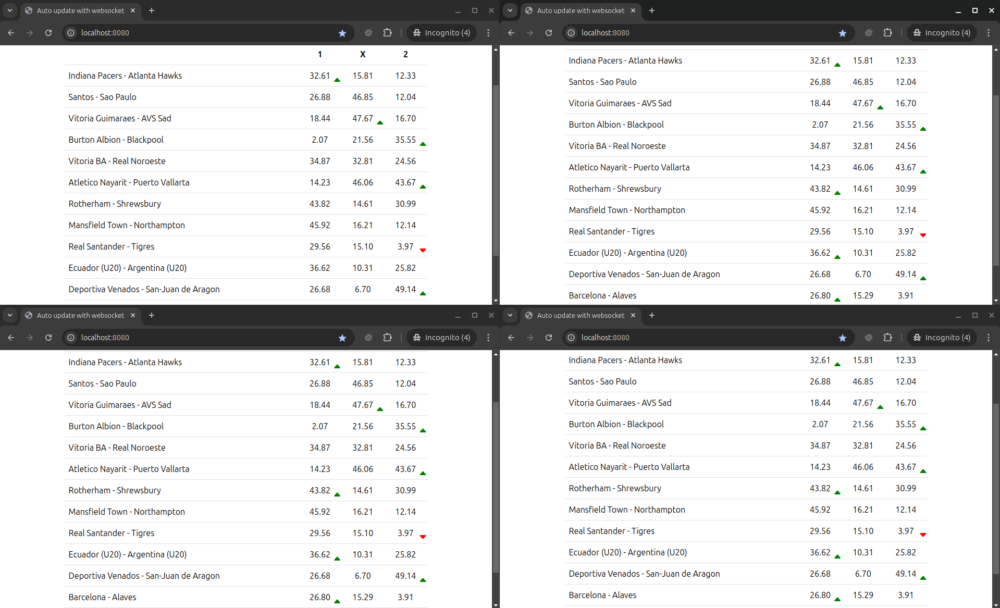

## Info pages
- [Effective Go](https://go.dev/doc/effective_go)
- [example echo source](https://github.com/gorilla/websocket/blob/main/examples/echo/server.go)
- [websocketsgo youtube](https://www.youtube.com/watch?v=pKpKv9MKN-E)
- [websocketsgo source](https://github.com/percybolmer/websocketsgo)

## App structure
- [example 1](https://medium.com/insiderengineering/a-pragmatic-and-systematic-project-structure-in-go-4a47b4fbe929)
- [example 2](https://github.com/golang-standards/project-layout)

## Routes (update page dir)
- [homepage](http://127.0.0.1:8080)
- [Api page with live matches](http://127.0.0.1:8080/api/matches/live)
- [Websocket url](ws://localhost:8080/ws)

Websocket subscribe payload example
```json
{
  "type": "subscribe",
  "payload": {"name": "live_odds"}
}
```

## Example auto update data via websocket (update-page dir)

